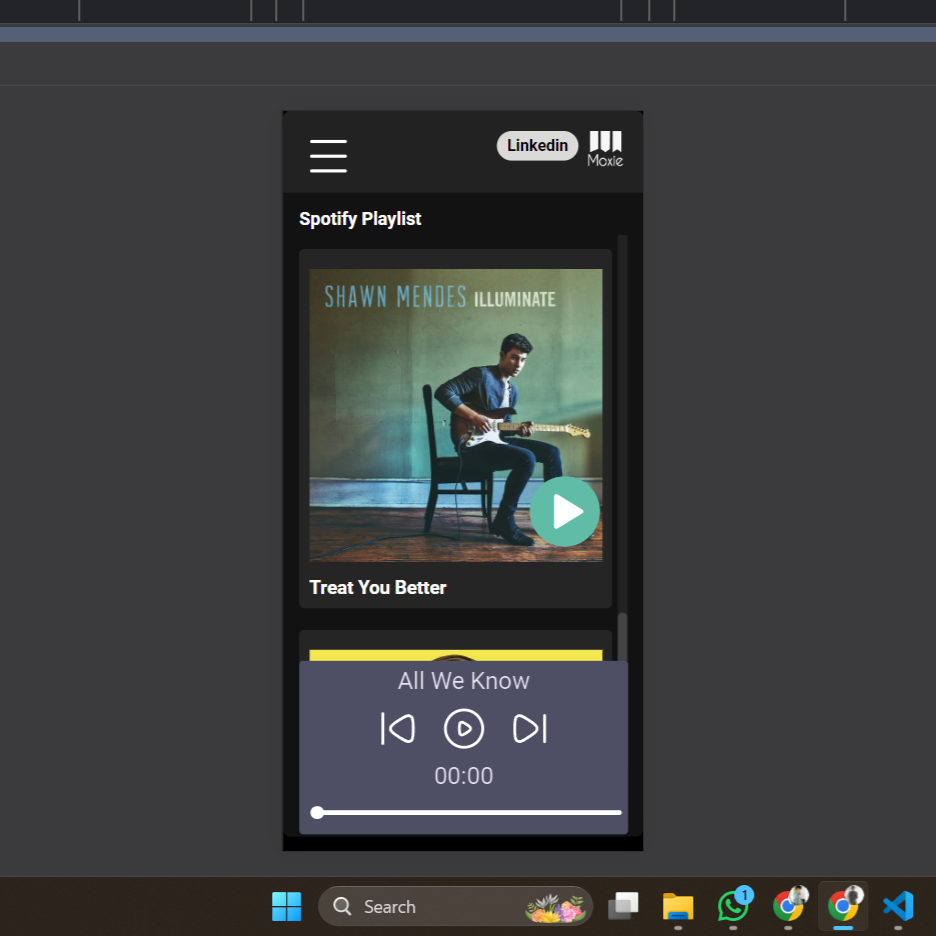
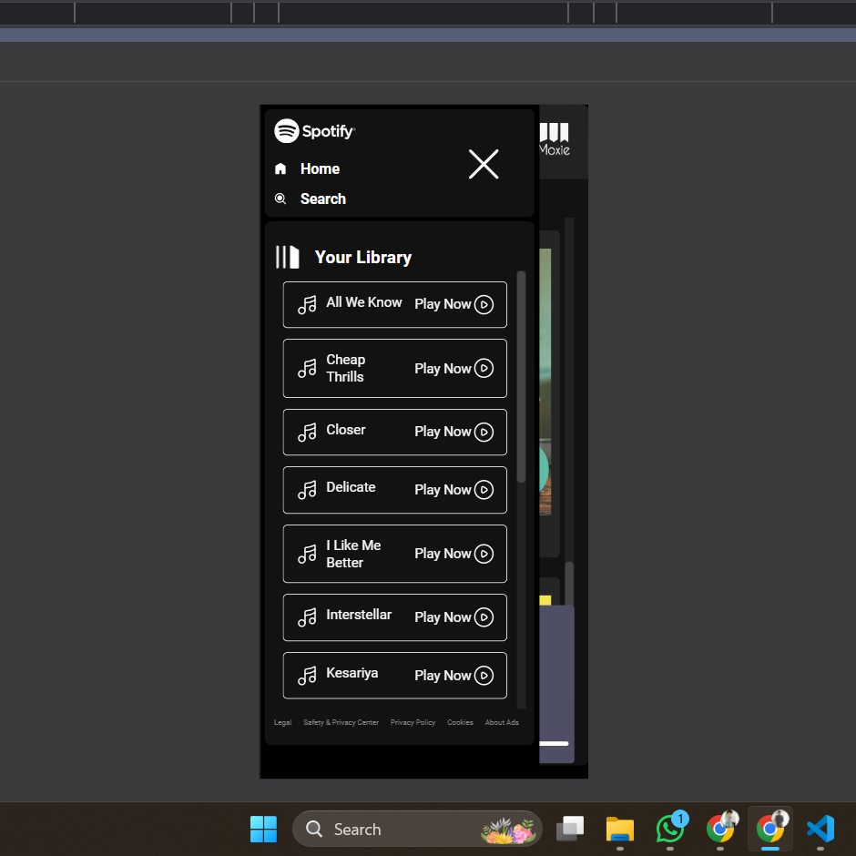

# 🚀 About Me
I'm a Frontend developer who builds the visible parts of websites and apps. I use code to create what you see and interact with, like buttons, menus, and animations!

 My Linkedin  

# Music Player  
## Netlify link ->  https://regal-mermaid-6cd743.netlify.app/
## GitHub Live link ->  https://sarfarazadil.github.io/music_player/

This Music Player website Built with the building blocks of the web - HTML, CSS, and JavaScript .   
The HTML provides the foundation, CSS steps in, adding style and turning your basic layout into a sleek music interface. Finally, JavaScript brings the magic.          
This is just the beginning! With a little more code, you can add features like playlists, Most played, favorite.....

## Laptop Preveiw    

## Mobile Preveiw

## Mobile Preveiw

## Features

- You can listen the music without Ads
- Responsiveness:The website adapts its layout to fit screen 
- Playback Controls: Play, pause, previous,
- Visual Feedback: Progress bar that updates in real-time
- Progress bar: Visual indicator of the song's current playback position.

## Technology used

*HTML*

*CSS*

*JAVASCRIPT*

## Feedback

If you have any feedback, please reach out to me at sarfarazadil18@gmail.com

## 🔗 My Linkedin

